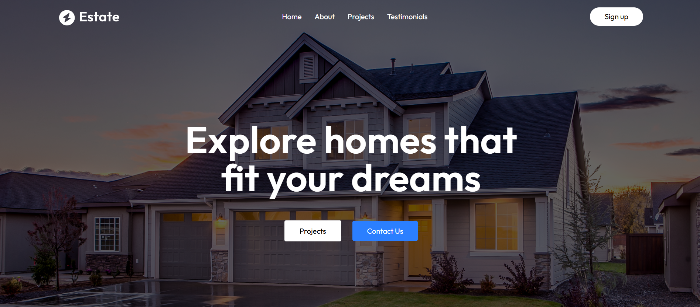
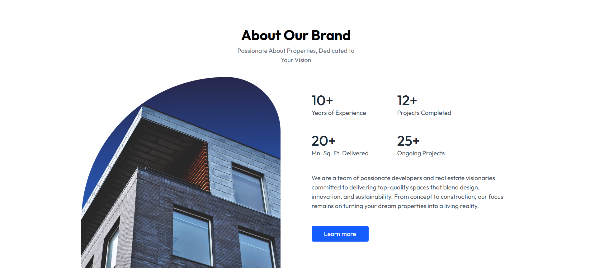
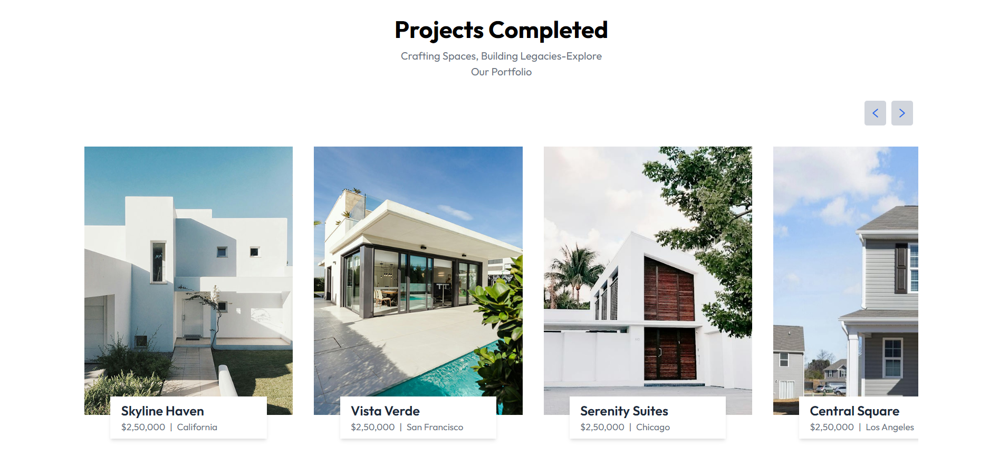
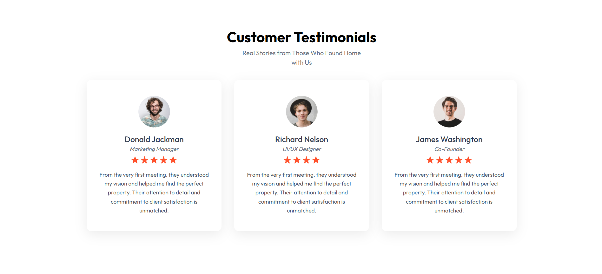
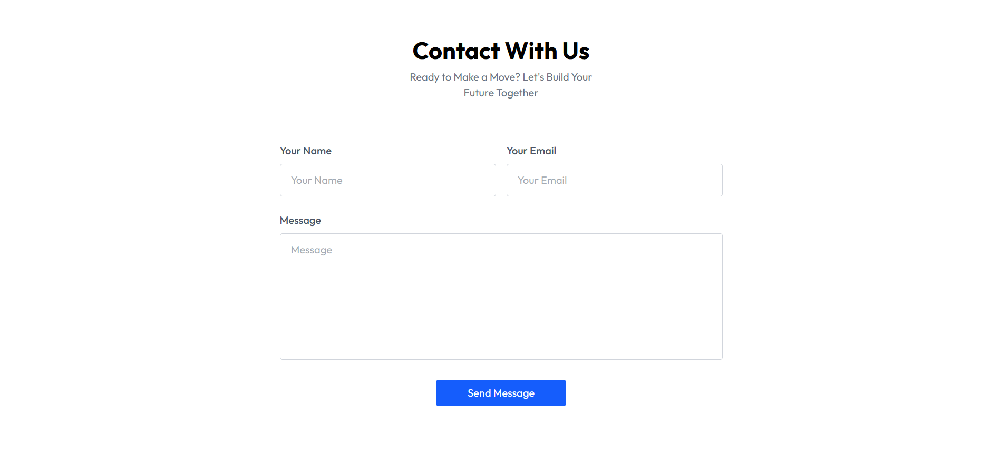
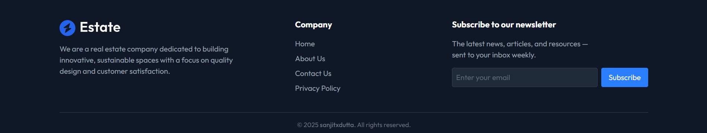

# 🏡 Estate - Real Estate Landing Page (Tailwind CSS Practice)


**Estate** is a modern, fully responsive real estate landing page created for practicing **Tailwind CSS**. This project showcases essential front-end design skills with real-world components such as a hero section, project carousel, testimonials, and contact form — all styled using Tailwind's utility-first approach.

[🌐 View Live Site →](https://estate-s.vercel.app/)

---

## 📸 Preview

### 🏠 Home Page (Hero Section)


### 📖 About Us


### 🏗 Projects


### 💬 Testimonials


### 📬 Contact Us


### 📩 Footer & Newsletter


---

## ✨ Features

- 🌟 Clean and modern UI
- 📱 Fully responsive layout (Mobile, Tablet, Desktop)
- 🧩 Hero section with CTA buttons
- 🏗️ Dynamic projects carousel
- 🗣️ Customer testimonials with star ratings
- 📬 Functional contact form powered by Web3Forms
- 📧 Functional newsletter subscription form with validation
- ⚙️ Built entirely using Tailwind CSS utility classes
- 🌙 Dark footer with useful links and subscription
- 🧪 Developed using Vite + React for speed and modularity

---

## 🛠️ Tech Stack

| Tool / Library     | Purpose                              |
|--------------------|--------------------------------------|
| **React**          | Component-based UI development       |
| **Tailwind CSS**   | Utility-first CSS framework          |
| **Vite**           | Lightning-fast dev build tool        |
| **Web3Forms**      | Serverless contact form integration  |
| **React Toastify** | Notifications (form submission status) |
| **Vercel**         | Hosting and deployment platform      |

---

## 🚀 Getting Started

1. **Clone the repository**
   ```bash
   git clone https://github.com/your-username/estate.git
   cd estate
   ```
2. **Install dependencies**
   ```bash
   npm install
   ```
3. **Add environment variable**
   - Create a .env file in the root with:
   ```bash
   VITE_WEB3FORM_KEY=your_web3form_access_key
   ```
4. **Start the development server**
   ```bash
   npm run dev
   ```

---

## 📂 Folder Structure

 ```bash
estate/
├── public/
├── src/
│ ├── assets/
│ ├── components/ 
│ │ ├── About.jsx
│ │ ├── Contact.jsx
│ │ ├── Footer.jsx
│ │ ├── Header.jsx
│ │ ├── Navbar.jsx
│ │ ├── Projects.jsx
│ │ └── Testimonials.jsx
│ ├── App.jsx 
│ ├── index.css 
│ └── main.jsx 
├── .env 
├── LICENSE 
├── README.md
└── package.json
   ```

---

## 📄 License
This project is licensed under the MIT License.

You’re free to use, modify, and distribute this project as you like.

---

## 🙌 Acknowledgments
Built with 💙 using Tailwind CSS.

Form handling powered by Web3Forms.

Hosted on Vercel.

---

## 🧠 Motivation
This project was built as part of my Tailwind CSS learning journey. The goal was to practice responsive design, layout building, form integrations, and component styling without relying on prebuilt UI kits.
